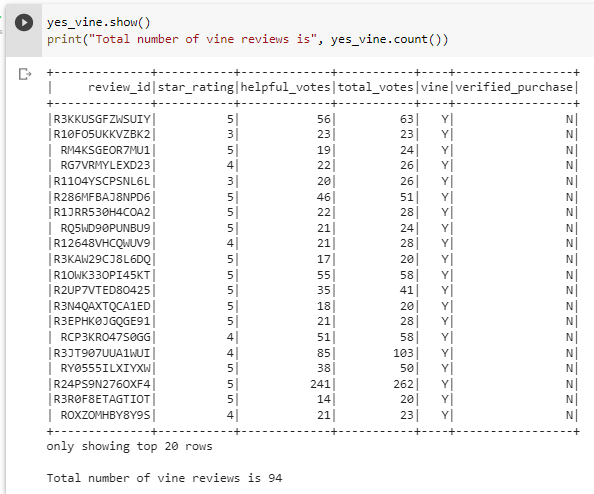

# Amazon_Vine_Analysis

## Overview of Videogame Amazon Reviews

### Purpose
Our purpose for this project was a continuation from previous work assisting the company SellBy which conducts business through Amazon by selling products through the online marketplace. SellBy asked for our help by analyzing Amazon reviews written by members of the paid Amazon Vine program. This program allows SellBy to provide their products to Amazon Vine members who are then required to publish a review. For this project we analyzed a dataset containing video game reviews and used PySpark to perform the ETL process by extracting the dataset, transforming the data, and loading the transformed data into pgAdmin by connecting to an AWS RDS instance. From there we continued to use PySpark for further review of the Vine program to determine if there was any bias toward favorable reviews for the products from Vine members. 

## Review Results 

### Key Review Statistical Points
- In the Videogame Review dataset there was a total of 94 Vine program reviews. 
- For the non-Vine reviews there was a total of 40,471 non-Vine program reviews.

- There was a total of 48 five star reviews given from the Vine program results. 
- There was a total of 15,663 five star reviews given from the non-Vine program results.

- The percentage of Vine reviews that were 5 stars is 51.1%. 
- The percentage of non-Vine reviews that were 5 stars is 38.7%.

![five_star_non_vine_percentage.png)

## Vine Review Summary 

### Analysis Takeaways & Further Research

From the results of the analysis, they show that there is a slight positivity bias within the Vine program for their reviews. The percentage of five star reviews for the vine program is above half the total amount at 51.1%, which is larger than the non-Vine program results that were determined to be at 38.7%. This is even more evident when the total number of reviews is taken into account, because the non-Vine program had an much larger number of reviews submitted than the Vine program. Even at the small number of reviews submitted for the Vine program though (94), more than half of these were five stars. Another analysis we can complete to review the positivity bias is reviewing the number of one star reviews entered from reviewers within the Vine program, and compare this number or percentage with the same statistic from the non-Vine program reviews. From this we can see how often or possibly infrequent a poor review is entered from a Vine program reviewer. 
